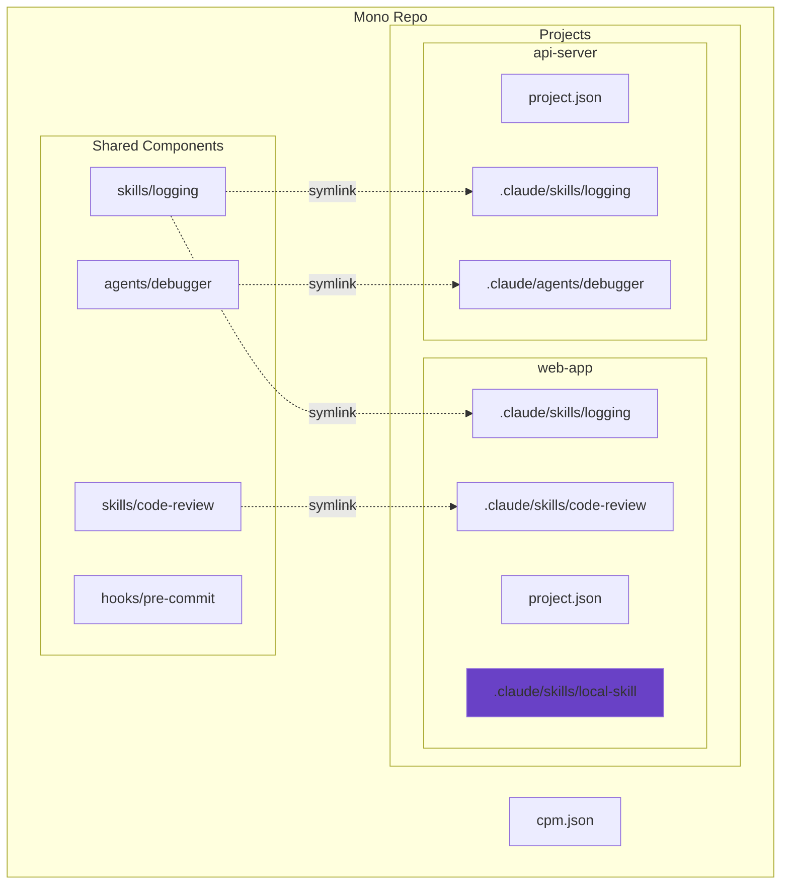
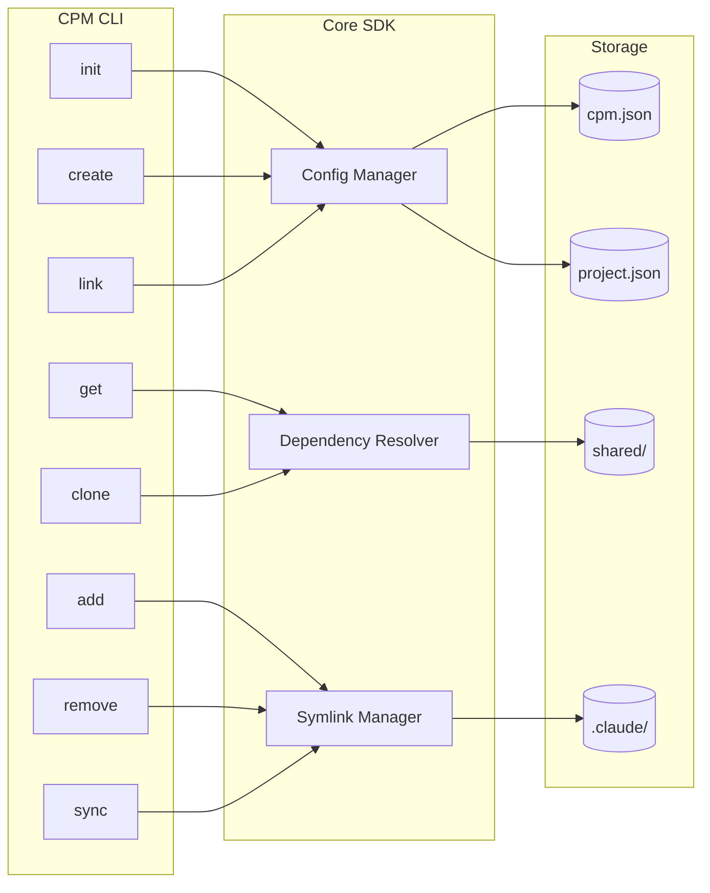
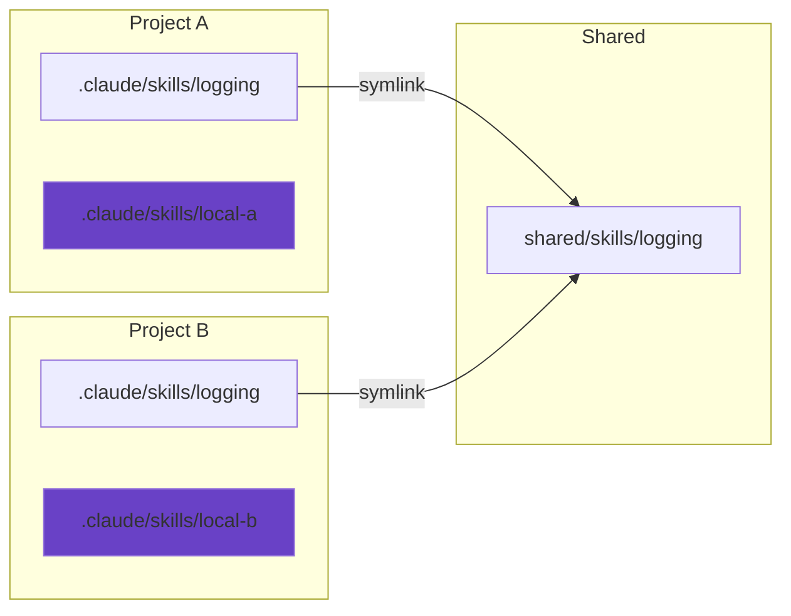
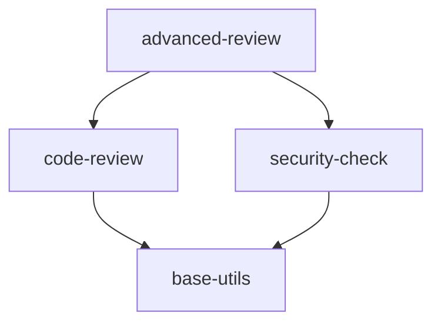
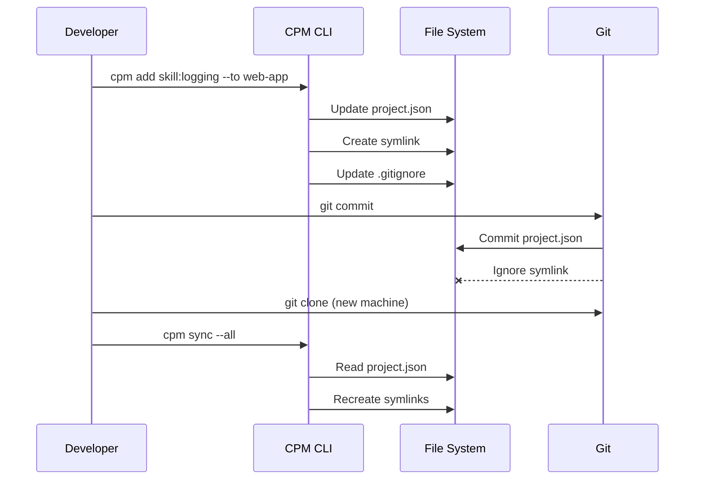

# CPM - Claude Project Manager

An SDK and CLI for managing mono repos with multiple Claude Code projects. Supports shared skills, agents, hooks, and rules across projects without duplication.

[](https://www.python.org/downloads/)
[](LICENSE)

## Overview

CPM enables sharing components across multiple Claude Code projects using a hybrid linking strategy. References are stored in config files, and symlinks are generated locally for fast access.



## Installation

```bash
pip install cpm
```

Or with pipx for isolated installation:

```bash
pipx install cpm
```

## Quick Start

```bash
# Initialize a new mono repo
cpm init my-monorepo
cd my-monorepo

# Create a project
cpm create project web-app

# Create shared components
cpm create skill logging -d "Logging utilities"
cpm create agent code-reviewer -d "Code review assistant"

# Add components to project
cpm add skill:logging --to web-app
cpm add agent:code-reviewer --to web-app

# View project with resolved dependencies
cpm get web-app

# After git clone, restore symlinks
cpm sync --all
```

## Architecture



## Shared vs Local Components

CPM supports two types of components:

| Type | Location | Git Status | Use Case |
|------|----------|------------|----------|
| **Shared** | `shared/{type}/{name}` | Committed, symlinked to projects | Reusable across multiple projects |
| **Local** | `projects/{project}/.claude/{type}/{name}` | Committed directly | Project-specific, not shared |



## Component Dependencies

Shared components can depend on other shared components:



```bash
# Create component with dependencies
cpm create skill advanced-review --skills code-review,security-check

# Link dependencies to existing component
cpm link skill:base-utils --to skill:code-review

# Remove dependencies
cpm unlink skill:base-utils --from skill:code-review
```

## Directory Structure

```
my-monorepo/
├── cpm.json                    # Root configuration
├── CLAUDE.md                   # Root instructions
├── shared/                     # Shared components (committed)
│   ├── skills/
│   │   └── logging/
│   │       ├── SKILL.md
│   │       └── skill.json
│   ├── agents/
│   ├── hooks/
│   └── rules/
└── projects/
    └── web-app/
        ├── project.json        # Dependencies defined here
        ├── CLAUDE.md
        └── .claude/
            ├── skills/
            │   ├── .gitignore        # Ignores symlinks only
            │   ├── logging/ -> symlink (ignored)
            │   └── local-skill/      # Committed
            ├── agents/
            ├── hooks/
            └── rules/
```

## Commands

| Command | Description |
|---------|-------------|
| `cpm init` | Initialize a new mono repo |
| `cpm create project` | Create a new project |
| `cpm create skill/agent/hook/rule` | Create shared components |
| `cpm add` | Add a shared component to a project |
| `cpm remove` | Remove a shared component from a project |
| `cpm link` | Link dependencies between shared components |
| `cpm unlink` | Remove dependencies between shared components |
| `cpm get` | Get project info with resolved dependencies |
| `cpm clone` | Clone a project with all dependencies |
| `cpm sync` | Regenerate symlinks for shared components |

### Remote Repository Support

```bash
# View remote project
cpm get my-project --remote owner/repo

# Download remote project
cpm get my-project -r owner/repo --download --output ./local-copy
```

## Documentation

| Document | Description |
|----------|-------------|
| [Python SDK](python/README.md) | Python SDK and CLI |
| [TypeScript SDK](typescript/README.md) | TypeScript/Node.js SDK and CLI |
| [Full Documentation](docs/) | Complete Mintlify documentation |

## SDKs

### Python

```bash
pip install cpm
```

```python
from cpm.core.config import load_cpm_config, list_projects
from cpm.core.resolver import resolve_project, list_shared_components

# Load configuration
config = load_cpm_config("/path/to/monorepo")

# List all projects
projects = list_projects("/path/to/monorepo")

# Resolve a project with all dependencies
project = resolve_project("my-project", "/path/to/monorepo")
```

### TypeScript

```bash
npm install cpm
```

```typescript
import {
  loadCpmConfig,
  listProjects,
  resolveProject,
  listSharedComponents,
} from "cpm";

// Load configuration
const config = await loadCpmConfig("/path/to/monorepo");

// List all projects
const projects = await listProjects("/path/to/monorepo");

// Resolve a project with all dependencies
const project = await resolveProject("my-project", "/path/to/monorepo");
```

See [SDK Reference](python/SDK.md) for complete API documentation.

## How It Works



1. **Source of truth**: `project.json` stores component references
2. **Local optimization**: Symlinks generated via `cpm sync`
3. **Git-friendly**: Per-directory `.gitignore` ignores only symlinks
4. **Cross-platform**: `cpm sync` regenerates symlinks after clone

## Development

```bash
cd python
pip install -e ".[dev]"
pytest
```

## Contributing

Contributions are welcome! See [Contributing Guide](CONTRIBUTING.md) and [Code of Conduct](CODE_OF_CONDUCT.md).

## Security

For security concerns, see [Security Policy](SECURITY.md).

## License

MIT License - see [LICENSE](LICENSE) for details.

---

<p align="center">
  <a href="https://transilience.ai"></a>
</p>

<p align="center">
  Crafted by <a href="https://transilience.ai">Transilience.ai</a>
</p>
