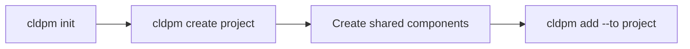
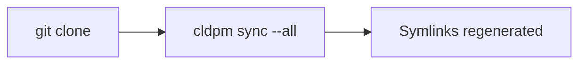
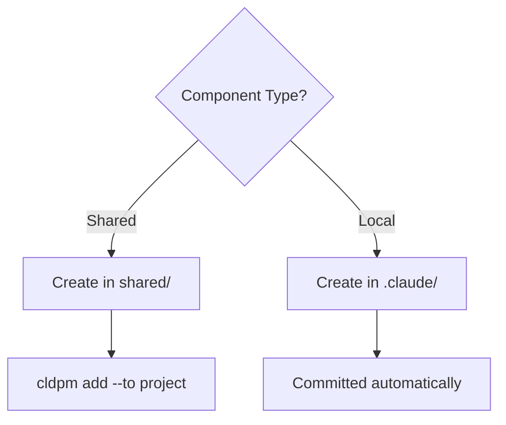

# Core Concepts

Understanding CLDPM's architecture and terminology.

## Components

CLDPM manages four types of Claude Code components:

| Type | Description | Location |
|------|-------------|----------|
| **Skills** | Reusable capabilities and instructions | `.claude/skills/` |
| **Agents** | Autonomous task executors | `.claude/agents/` |
| **Hooks** | Event-triggered scripts | `.claude/hooks/` |
| **Rules** | Behavioral constraints | `.claude/rules/` |

## Shared vs Local Components

import { Callout } from 'nextra/components'

<div className="grid grid-cols-1 md:grid-cols-2 gap-4 mt-4">
<Callout type="info" emoji="🔗">
**Shared Components**
- Stored in `shared/` directory
- Symlinked to projects via `cldpm add`
- Symlinks are gitignored
- Reference stored in `project.json`
</Callout>

<Callout type="info" emoji="📁">
**Local Components**
- Stored directly in project's `.claude/`
- Project-specific, not shared
- Committed to git
- No reference in `project.json`
</Callout>
</div>

### When to Use Shared Components

- Code review standards used across all projects
- Common testing patterns
- Organization-wide hooks
- Reusable agent configurations

### When to Use Local Components

- Project-specific business logic
- Custom workflows for one project
- Experimental features
- Components still in development

## Component Dependencies

Shared components can depend on other shared components. This is useful when:
- An agent requires specific skills to function
- A skill builds on another skill's capabilities
- A hook needs a skill for validation

### Declaring Dependencies

Add a `dependencies` field to the component's metadata file:

```json
// shared/agents/security-audit/agent.json
{
  "name": "security-audit",
  "description": "Security audit agent",
  "dependencies": {
    "skills": ["vulnerability-scan", "code-review"],
    "hooks": ["pre-commit-lint"]
  }
}
```

### Dependency Resolution

When you add a component with dependencies:

```bash
cldpm add agent:security-audit --to my-project
```

CLDPM automatically:
1. Resolves all dependencies (including transitive)
2. Adds them to `project.json`
3. Creates symlinks for each

```
✓ Added agents/security-audit to my-project
  ✓ skills/vulnerability-scan (dependency)
  ✓ skills/code-review (dependency)
  ✓ hooks/pre-commit-lint (dependency)
```

### Removing with Dependencies

When removing a component, CLDPM identifies orphaned dependencies:

```bash
cldpm remove agent:security-audit --from my-project
```

Dependencies used only by the removed component are offered for removal.

## Configuration Files

### cldpm.json (Root)

Located at the mono repo root. Defines global settings:

```json
{
  "name": "my-monorepo",
  "version": "1.0.0",
  "projectsDir": "projects",
  "sharedDir": "shared"
}
```

| Field | Description | Default |
|-------|-------------|---------|
| `name` | Mono repo name | Directory name |
| `version` | Version string | `"1.0.0"` |
| `projectsDir` | Projects directory | `"projects"` |
| `sharedDir` | Shared components directory | `"shared"` |

### project.json (Project)

Located in each project directory. Tracks dependencies:

```json
{
  "name": "my-project",
  "description": "Project description",
  "dependencies": {
    "skills": ["code-review", "testing"],
    "agents": ["debugger"],
    "hooks": [],
    "rules": ["security"]
  }
}
```

## Linking Strategy

CLDPM uses symlinks for efficiency while maintaining git compatibility:

```
projects/my-app/.claude/skills/
├── code-review -> ../../../shared/skills/code-review  (symlink, gitignored)
├── my-local-skill/  (directory, committed)
└── .gitignore  (lists only symlinked items)
```

### Per-Directory .gitignore

Each component directory has its own `.gitignore`:

```gitignore
# CLDPM shared components (symlinks to shared/)
# These are regenerated via 'cldpm sync' - do not commit symlinks
# Project-specific components in this directory WILL be committed

code-review
testing
```

This approach:
- Ignores only symlinked (shared) components
- Commits local (project-specific) components
- Allows mixed usage in the same directory

## Workflow

### Initial Setup



### After Git Clone



### Adding Components


