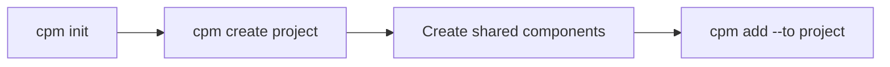
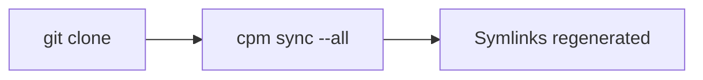
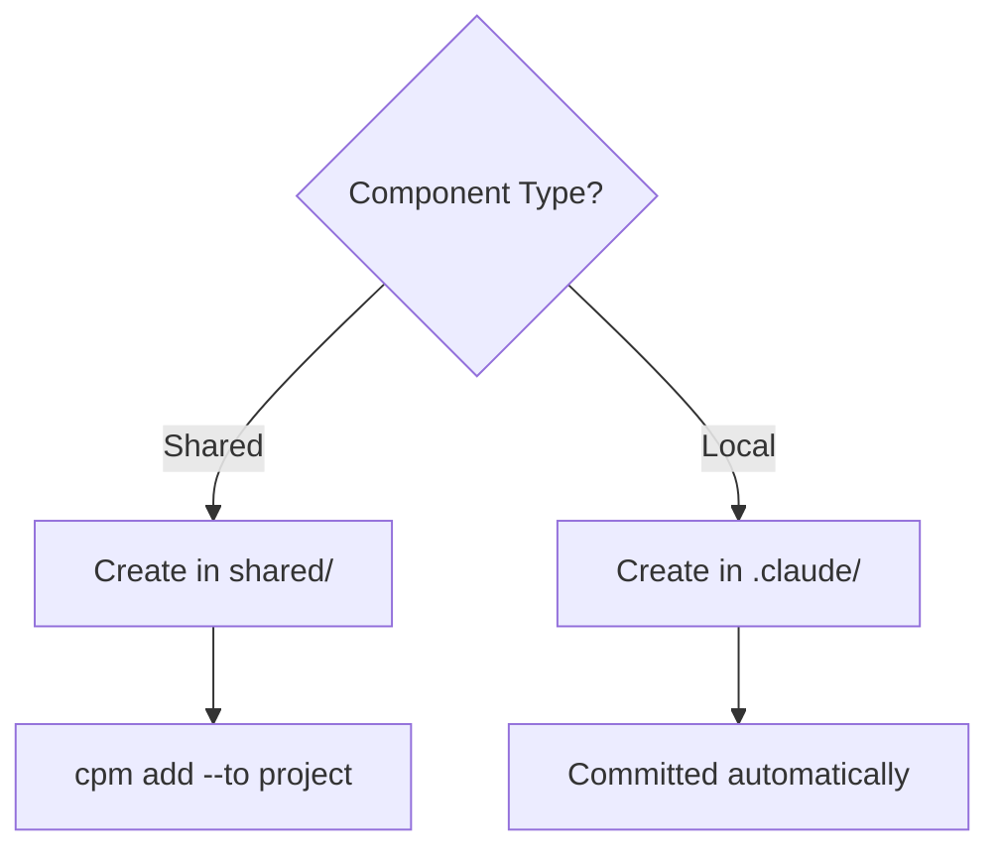

## Components

CPM manages four types of Claude Code components:

| Type | Description | Location |
|------|-------------|----------|
| **Skills** | Reusable capabilities and instructions | `.claude/skills/` |
| **Agents** | Autonomous task executors | `.claude/agents/` |
| **Hooks** | Event-triggered scripts | `.claude/hooks/` |
| **Rules** | Behavioral constraints | `.claude/rules/` |

## Shared vs Local Components

<CardGroup cols={2}>
  <Card title="Shared Components" icon="share-nodes">
    - Stored in `shared/` directory
    - Symlinked to projects via `cpm add`
    - Symlinks are gitignored
    - Reference stored in `project.json`
  </Card>
  <Card title="Local Components" icon="folder">
    - Stored directly in project's `.claude/`
    - Project-specific, not shared
    - Committed to git
    - No reference in `project.json`
  </Card>
</CardGroup>

### When to Use Shared Components

- Code review standards used across all projects
- Common testing patterns
- Organization-wide hooks
- Reusable agent configurations

### When to Use Local Components

- Project-specific business logic
- Custom workflows for one project
- Experimental features
- Components still in development

## Configuration Files

### cpm.json (Root)

Located at the mono repo root. Defines global settings:

```json
{
  "name": "my-monorepo",
  "version": "1.0.0",
  "projectsDir": "projects",
  "sharedDir": "shared"
}
```

| Field | Description | Default |
|-------|-------------|---------|
| `name` | Mono repo name | Directory name |
| `version` | Version string | `"1.0.0"` |
| `projectsDir` | Projects directory | `"projects"` |
| `sharedDir` | Shared components directory | `"shared"` |

### project.json (Project)

Located in each project directory. Tracks dependencies:

```json
{
  "name": "my-project",
  "description": "Project description",
  "dependencies": {
    "skills": ["code-review", "testing"],
    "agents": ["debugger"],
    "hooks": [],
    "rules": ["security"]
  }
}
```

## Linking Strategy

CPM uses symlinks for efficiency while maintaining git compatibility:

```
projects/my-app/.claude/skills/
├── code-review -> ../../../shared/skills/code-review  (symlink, gitignored)
├── my-local-skill/  (directory, committed)
└── .gitignore  (lists only symlinked items)
```

### Per-Directory .gitignore

Each component directory has its own `.gitignore`:

```gitignore
# CPM shared components (symlinks to shared/)
# These are regenerated via 'cpm sync' - do not commit symlinks
# Project-specific components in this directory WILL be committed

code-review
testing
```

This approach:
- Ignores only symlinked (shared) components
- Commits local (project-specific) components
- Allows mixed usage in the same directory

## Workflow

### Initial Setup



### After Git Clone



### Adding Components


