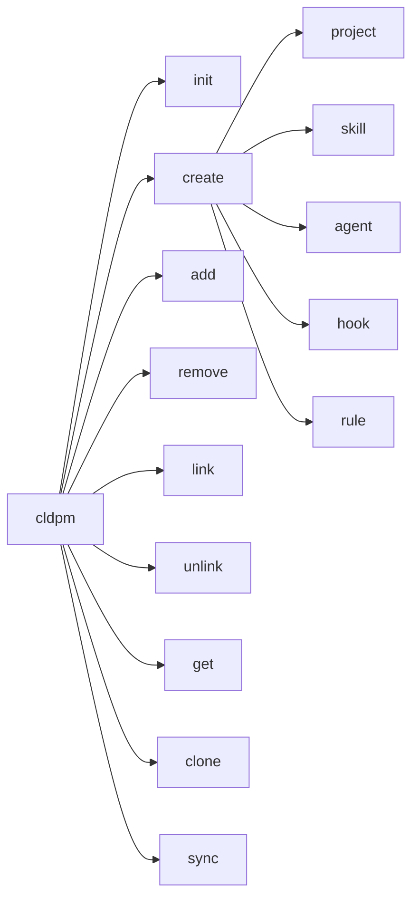

# CLDPM CLI Reference

Complete reference for CLDPM command-line interface.

## Installation

```bash
pip install cldpm
```

## Commands Overview



## Commands

### `cldpm init`

Initialize a new CLDPM mono repo.

```bash
cldpm init [DIRECTORY] [OPTIONS]
```

**Arguments:**
- `DIRECTORY` - Directory name (default: current directory)

**Options:**
- `-n, --name TEXT` - Repository name
- `-e, --existing` - Initialize in existing directory without overwriting files
- `-a, --adopt-projects TEXT` - Adopt existing directories as projects (comma-separated or 'auto')
- `-p, --projects-dir TEXT` - Directory for projects (default: projects)
- `-s, --shared-dir TEXT` - Directory for shared components (default: shared)

**Created Files:**

| File | Purpose |
|------|---------|
| `cldpm.json` | Root mono repo configuration |
| `CLAUDE.md` | Instructions for Claude Code |
| `.cursor/rules/cldpm.mdc` | Rules for Cursor IDE |
| `.clinerules` | Rules for Cline |
| `.windsurfrules` | Rules for Windsurf |
| `.github/copilot-instructions.md` | Instructions for GitHub Copilot |
| `.gitignore` | Git ignore patterns |

**AI Tool Configuration:**

All AI tool files include CLDPM commands and project structure documentation. Content is wrapped with section markers (`<!-- CLDPM-SECTION-START -->` / `<!-- CLDPM-SECTION-END -->`) for easy updates.

When using `--existing`:
- Updates existing CLDPM sections if markers are present
- Appends sections to files without CLDPM content
- Skips files that already have unmarked CLDPM content

**Example:**
```bash
cldpm init my-monorepo
cldpm init . --name "My Project Hub"
cldpm init --existing --adopt-projects auto
cldpm init -e -a "app,api" -p src -s common
```

---

### `cldpm create`

Create new projects or shared components.

#### `cldpm create project`

```bash
cldpm create project NAME [OPTIONS]
```

**Options:**
- `-d, --description TEXT` - Project description
- `-s, --skills TEXT` - Comma-separated skills to add

**Example:**
```bash
cldpm create project web-app -d "Web application"
cldpm create project api --skills logging,auth
```

#### `cldpm create skill`

```bash
cldpm create skill NAME [OPTIONS]
```

**Options:**
- `-d, --description TEXT` - Skill description
- `-s, --skills TEXT` - Dependent skills
- `-a, --agents TEXT` - Dependent agents
- `-h, --hooks TEXT` - Dependent hooks
- `-r, --rules TEXT` - Dependent rules

**Example:**
```bash
cldpm create skill code-review -d "Code review assistant"
cldpm create skill advanced-review --skills code-review,security
```

#### `cldpm create agent`

```bash
cldpm create agent NAME [OPTIONS]
```

**Options:** Same as `cldpm create skill`

#### `cldpm create hook`

```bash
cldpm create hook NAME [OPTIONS]
```

**Options:** Same as `cldpm create skill`

#### `cldpm create rule`

```bash
cldpm create rule NAME [OPTIONS]
```

**Options:** Same as `cldpm create skill`

---

### `cldpm add`

Add a shared component to a project.

```bash
cldpm add COMPONENT --to PROJECT [OPTIONS]
```

**Arguments:**
- `COMPONENT` - Component in format `type:name` (e.g., `skill:logging`)

**Options:**
- `-t, --to TEXT` - Target project name (required)
- `--no-deps` - Don't install component dependencies

**Example:**
```bash
cldpm add skill:logging --to web-app
cldpm add agent:debugger --to api-server --no-deps
```

---

### `cldpm remove`

Remove a shared component from a project.

```bash
cldpm remove COMPONENT --from PROJECT [OPTIONS]
```

**Arguments:**
- `COMPONENT` - Component in format `type:name`

**Options:**
- `-f, --from TEXT` - Source project name (required)
- `--keep-deps` - Keep orphaned dependencies
- `--force` - Remove without confirmation

**Example:**
```bash
cldpm remove skill:logging --from web-app
cldpm remove agent:debugger --from api --force
```

---

### `cldpm link`

Link dependencies to an existing shared component.

```bash
cldpm link DEPENDENCIES --to TARGET
```

**Arguments:**
- `DEPENDENCIES` - Comma-separated list (e.g., `skill:a,agent:b`)

**Options:**
- `-t, --to TEXT` - Target component (required)

**Example:**
```bash
cldpm link skill:base-utils --to skill:code-review
cldpm link skill:logging,hook:validator --to agent:debugger
```

---

### `cldpm unlink`

Remove dependencies from an existing shared component.

```bash
cldpm unlink DEPENDENCIES --from TARGET
```

**Arguments:**
- `DEPENDENCIES` - Comma-separated list

**Options:**
- `-f, --from TEXT` - Source component (required)

**Example:**
```bash
cldpm unlink skill:base-utils --from skill:code-review
```

---

### `cldpm get`

Get project info with all resolved components.

```bash
cldpm get PROJECT [OPTIONS]
```

**Arguments:**
- `PROJECT` - Project name or path

**Options:**
- `-f, --format [tree|json]` - Output format (default: tree)
- `-r, --remote TEXT` - Remote GitHub repo (owner/repo)
- `-d, --download` - Download remote project
- `-o, --output PATH` - Output directory for download

**Example:**
```bash
cldpm get web-app
cldpm get web-app --format json
cldpm get my-project -r owner/repo --download
```

---

### `cldpm clone`

Clone a project to a standalone directory with all dependencies.

```bash
cldpm clone PROJECT DIRECTORY [OPTIONS]
```

**Arguments:**
- `PROJECT` - Project name or path
- `DIRECTORY` - Target directory

**Options:**
- `--include-shared` - Include full shared/ directory

**Example:**
```bash
cldpm clone web-app ./standalone
cldpm clone api-server /tmp/export --include-shared
```

---

### `cldpm sync`

Regenerate symlinks for shared components.

```bash
cldpm sync [PROJECT] [OPTIONS]
```

**Arguments:**
- `PROJECT` - Project name (optional)

**Options:**
- `-a, --all` - Sync all projects

**Example:**
```bash
cldpm sync web-app
cldpm sync --all
```

---

## Global Options

```bash
cldpm --help     # Show help
cldpm --version  # Show version
```

## Exit Codes

| Code | Description |
|------|-------------|
| 0 | Success |
| 1 | Error |

## Environment Variables

| Variable | Description |
|----------|-------------|
| `GITHUB_TOKEN` | GitHub token for private repos |
| `GH_TOKEN` | Alternative GitHub token |
