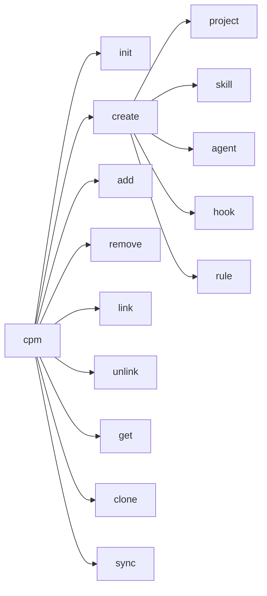

# CPM CLI Reference

Complete reference for CPM command-line interface.

## Installation

```bash
pip install cpm
```

## Commands Overview



## Commands

### `cpm init`

Initialize a new CPM mono repo.

```bash
cpm init [DIRECTORY] [OPTIONS]
```

**Arguments:**
- `DIRECTORY` - Directory name (default: current directory)

**Options:**
- `-n, --name TEXT` - Repository name

**Example:**
```bash
cpm init my-monorepo
cpm init . --name "My Project Hub"
```

---

### `cpm create`

Create new projects or shared components.

#### `cpm create project`

```bash
cpm create project NAME [OPTIONS]
```

**Options:**
- `-d, --description TEXT` - Project description
- `-s, --skills TEXT` - Comma-separated skills to add

**Example:**
```bash
cpm create project web-app -d "Web application"
cpm create project api --skills logging,auth
```

#### `cpm create skill`

```bash
cpm create skill NAME [OPTIONS]
```

**Options:**
- `-d, --description TEXT` - Skill description
- `-s, --skills TEXT` - Dependent skills
- `-a, --agents TEXT` - Dependent agents
- `-h, --hooks TEXT` - Dependent hooks
- `-r, --rules TEXT` - Dependent rules

**Example:**
```bash
cpm create skill code-review -d "Code review assistant"
cpm create skill advanced-review --skills code-review,security
```

#### `cpm create agent`

```bash
cpm create agent NAME [OPTIONS]
```

**Options:** Same as `cpm create skill`

#### `cpm create hook`

```bash
cpm create hook NAME [OPTIONS]
```

**Options:** Same as `cpm create skill`

#### `cpm create rule`

```bash
cpm create rule NAME [OPTIONS]
```

**Options:** Same as `cpm create skill`

---

### `cpm add`

Add a shared component to a project.

```bash
cpm add COMPONENT --to PROJECT [OPTIONS]
```

**Arguments:**
- `COMPONENT` - Component in format `type:name` (e.g., `skill:logging`)

**Options:**
- `-t, --to TEXT` - Target project name (required)
- `--no-deps` - Don't install component dependencies

**Example:**
```bash
cpm add skill:logging --to web-app
cpm add agent:debugger --to api-server --no-deps
```

---

### `cpm remove`

Remove a shared component from a project.

```bash
cpm remove COMPONENT --from PROJECT [OPTIONS]
```

**Arguments:**
- `COMPONENT` - Component in format `type:name`

**Options:**
- `-f, --from TEXT` - Source project name (required)
- `--keep-deps` - Keep orphaned dependencies
- `--force` - Remove without confirmation

**Example:**
```bash
cpm remove skill:logging --from web-app
cpm remove agent:debugger --from api --force
```

---

### `cpm link`

Link dependencies to an existing shared component.

```bash
cpm link DEPENDENCIES --to TARGET
```

**Arguments:**
- `DEPENDENCIES` - Comma-separated list (e.g., `skill:a,agent:b`)

**Options:**
- `-t, --to TEXT` - Target component (required)

**Example:**
```bash
cpm link skill:base-utils --to skill:code-review
cpm link skill:logging,hook:validator --to agent:debugger
```

---

### `cpm unlink`

Remove dependencies from an existing shared component.

```bash
cpm unlink DEPENDENCIES --from TARGET
```

**Arguments:**
- `DEPENDENCIES` - Comma-separated list

**Options:**
- `-f, --from TEXT` - Source component (required)

**Example:**
```bash
cpm unlink skill:base-utils --from skill:code-review
```

---

### `cpm get`

Get project info with all resolved components.

```bash
cpm get PROJECT [OPTIONS]
```

**Arguments:**
- `PROJECT` - Project name or path

**Options:**
- `-f, --format [tree|json]` - Output format (default: tree)
- `-r, --remote TEXT` - Remote GitHub repo (owner/repo)
- `-d, --download` - Download remote project
- `-o, --output PATH` - Output directory for download

**Example:**
```bash
cpm get web-app
cpm get web-app --format json
cpm get my-project -r owner/repo --download
```

---

### `cpm clone`

Clone a project to a standalone directory with all dependencies.

```bash
cpm clone PROJECT DIRECTORY [OPTIONS]
```

**Arguments:**
- `PROJECT` - Project name or path
- `DIRECTORY` - Target directory

**Options:**
- `--include-shared` - Include full shared/ directory

**Example:**
```bash
cpm clone web-app ./standalone
cpm clone api-server /tmp/export --include-shared
```

---

### `cpm sync`

Regenerate symlinks for shared components.

```bash
cpm sync [PROJECT] [OPTIONS]
```

**Arguments:**
- `PROJECT` - Project name (optional)

**Options:**
- `-a, --all` - Sync all projects

**Example:**
```bash
cpm sync web-app
cpm sync --all
```

---

## Global Options

```bash
cpm --help     # Show help
cpm --version  # Show version
```

## Exit Codes

| Code | Description |
|------|-------------|
| 0 | Success |
| 1 | Error |

## Environment Variables

| Variable | Description |
|----------|-------------|
| `GITHUB_TOKEN` | GitHub token for private repos |
| `GH_TOKEN` | Alternative GitHub token |
