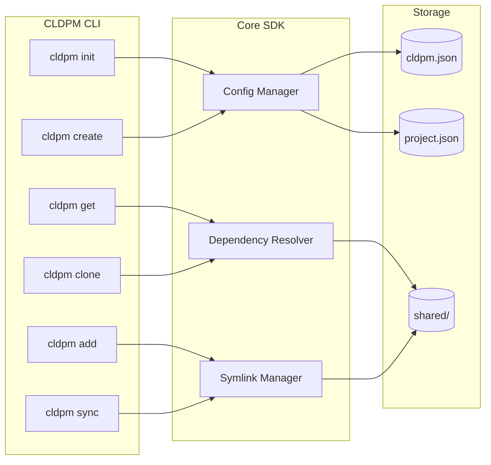
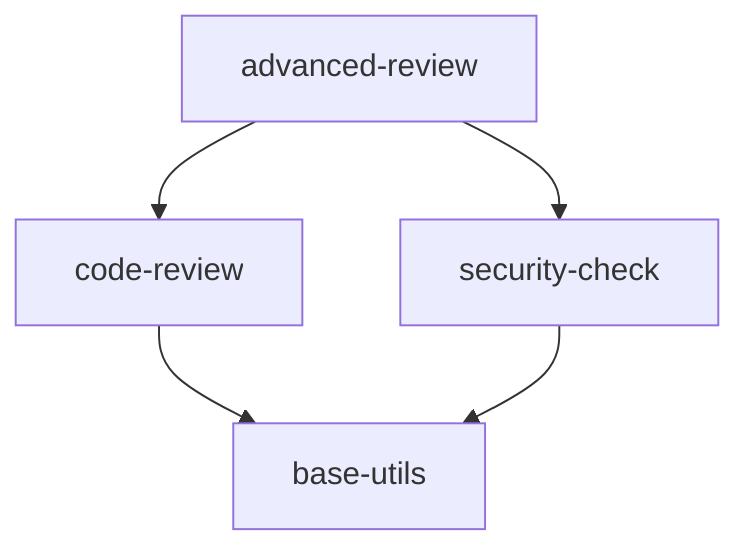

# CLDPM - Claude Project Manager

An SDK and CLI for managing mono repos with multiple Claude Code projects.

[](https://www.python.org/downloads/)
[](LICENSE)

## Overview

CLDPM enables sharing skills, agents, hooks, and rules across multiple Claude Code projects without duplication. It uses a hybrid linking strategy where references are stored in config files and symlinks are generated locally.

## Installation

```bash
pip install cldpm
```

Or with pipx for isolated installation:

```bash
pipx install cldpm
```

## Quick Start

```bash
# Initialize a new mono repo
cldpm init my-monorepo
cd my-monorepo

# Create a project
cldpm create project web-app

# Create shared components
cldpm create skill logging
cldpm create agent code-reviewer

# Add components to project
cldpm add skill:logging --to web-app
cldpm add agent:code-reviewer --to web-app

# View project with resolved dependencies
cldpm get web-app
```

## Architecture



## Directory Structure

```
my-monorepo/
├── cldpm.json                    # Root configuration
├── CLAUDE.md                   # Root instructions
├── shared/                     # Shared components
│   ├── skills/
│   │   └── logging/
│   │       ├── SKILL.md
│   │       └── skill.json
│   ├── agents/
│   ├── hooks/
│   └── rules/
└── projects/
    └── web-app/
        ├── project.json        # Dependencies defined here
        ├── CLAUDE.md
        └── .claude/
            ├── skills/         # Symlinks to shared/
            └── agents/
```

## Component Dependencies

Shared components can depend on other shared components:



```bash
# Create component with dependencies
cldpm create skill advanced-review --skills code-review,security-check

# Link dependencies to existing component
cldpm link skill:base-utils --to skill:code-review
```

## Documentation

| Document | Description |
|----------|-------------|
| [CLI Reference](CLI.md) | Complete CLI command reference |
| [SDK Reference](SDK.md) | Programmatic API documentation |
| [Full Docs](https://docs.cldpm.dev) | Complete documentation |

## Contributing

Contributions are welcome! Please read our [Contributing Guide](CONTRIBUTING.md) and [Code of Conduct](CODE_OF_CONDUCT.md).

## Security

For security concerns, please see our [Security Policy](SECURITY.md).

## License

MIT License - see [LICENSE](LICENSE) for details.

---

<p align="center">
  Crafted by <a href="https://transilience.ai"></a> <a href="https://transilience.ai">Transilience.ai</a>
</p>
