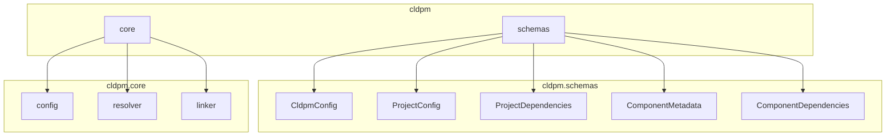

# CLDPM SDK Reference

Programmatic API for CLDPM - Claude Project Manager.

## Installation

```bash
pip install cldpm
```

## Module Overview



## Schemas

### CldpmConfig

Root configuration schema for `cldpm.json`.

```python
from cldpm.schemas import CldpmConfig

# Create config
config = CldpmConfig(
    name="my-monorepo",
    version="1.0.0",
    projects_dir="projects",  # default: "projects"
    shared_dir="shared",      # default: "shared"
)

# Serialize to dict (for JSON)
data = config.model_dump(by_alias=True)
# {"name": "my-monorepo", "version": "1.0.0", "projectsDir": "projects", "sharedDir": "shared"}

# Deserialize from dict
config = CldpmConfig.model_validate(data)
```

### ProjectConfig

Project configuration schema for `project.json`.

```python
from cldpm.schemas import ProjectConfig, ProjectDependencies

# Create project config
config = ProjectConfig(
    name="my-project",
    description="My project description",
    dependencies=ProjectDependencies(
        skills=["logging", "code-review"],
        agents=["debugger"],
        hooks=[],
        rules=[],
    ),
)

# Serialize
data = config.model_dump(exclude_none=True)

# Deserialize
config = ProjectConfig.model_validate(data)
```

### ComponentMetadata

Metadata schema for shared components (`skill.json`, `agent.json`, etc.).

```python
from cldpm.schemas import ComponentMetadata, ComponentDependencies

# Create component metadata
metadata = ComponentMetadata(
    name="advanced-review",
    description="Advanced code review skill",
    dependencies=ComponentDependencies(
        skills=["code-review", "security-check"],
        agents=[],
        hooks=[],
        rules=[],
    ),
)

# Allows extra fields
metadata = ComponentMetadata.model_validate({
    "name": "my-skill",
    "version": "1.0.0",  # extra field
    "author": "John",    # extra field
})
```

---

## Core Modules

### cldpm.core.config

Configuration loading and saving functions.

#### load_cldpm_config

Load `cldpm.json` from a repository root.

```python
from cldpm.core.config import load_cldpm_config

config = load_cldpm_config("/path/to/monorepo")
print(config.name)         # "my-monorepo"
print(config.projects_dir) # "projects"
print(config.shared_dir)   # "shared"
```

#### save_cldpm_config

Save `cldpm.json` to a repository root.

```python
from cldpm.core.config import save_cldpm_config
from cldpm.schemas import CldpmConfig

config = CldpmConfig(name="new-repo")
save_cldpm_config(config, "/path/to/monorepo")
```

#### load_project_config

Load `project.json` from a project directory.

```python
from cldpm.core.config import load_project_config

config = load_project_config("/path/to/monorepo/projects/my-project")
print(config.name)                    # "my-project"
print(config.dependencies.skills)     # ["logging", "code-review"]
```

#### save_project_config

Save `project.json` to a project directory.

```python
from cldpm.core.config import save_project_config
from cldpm.schemas import ProjectConfig

config = ProjectConfig(name="my-project")
save_project_config(config, "/path/to/project")
```

#### list_projects

List all projects in a repository.

```python
from cldpm.core.config import list_projects

projects = list_projects("/path/to/monorepo")
for project in projects:
    print(f"Project: {project.name}")
```

#### get_project_path

Get the path to a project by name.

```python
from cldpm.core.config import get_project_path

path = get_project_path("my-project", "/path/to/monorepo")
if path:
    print(f"Found at: {path}")
else:
    print("Project not found")
```

#### load_component_metadata

Load metadata for a shared component.

```python
from cldpm.core.config import load_component_metadata

metadata = load_component_metadata("skills", "code-review", "/path/to/monorepo")
if metadata:
    print(f"Name: {metadata.name}")
    print(f"Dependencies: {metadata.dependencies.skills}")
```

---

### cldpm.core.resolver

Project and component resolution functions.

#### resolve_project

Resolve a project with all its components.

```python
from cldpm.core.resolver import resolve_project

project = resolve_project("my-project", "/path/to/monorepo")

print(project["name"])           # "my-project"
print(project["path"])           # "/path/to/monorepo/projects/my-project"
print(project["config"])         # ProjectConfig object
print(project["shared"])         # {"skills": [...], "agents": [...], ...}
print(project["local"])          # {"skills": [...], "agents": [...], ...}

# Access resolved shared skills
for skill in project["shared"]["skills"]:
    print(f"Skill: {skill['name']}")
    print(f"Source: {skill['sourcePath']}")
    print(f"Files: {skill['files']}")
```

#### resolve_component

Resolve a shared component by type and name.

```python
from cldpm.core.resolver import resolve_component

component = resolve_component("skills", "code-review", "/path/to/shared")

if component:
    print(component["name"])        # "code-review"
    print(component["type"])        # "shared"
    print(component["sourcePath"])  # "/path/to/shared/skills/code-review"
    print(component["files"])       # ["SKILL.md", "skill.json"]
```

#### list_shared_components

List all shared components in a repository.

```python
from cldpm.core.resolver import list_shared_components

components = list_shared_components("/path/to/monorepo")

print(components["skills"])   # ["logging", "code-review", ...]
print(components["agents"])   # ["debugger", ...]
print(components["hooks"])    # [...]
print(components["rules"])    # [...]
```

#### resolve_component_dependencies

Resolve all dependencies for a component (including transitive).

```python
from cldpm.core.resolver import resolve_component_dependencies

deps = resolve_component_dependencies("skills", "advanced-review", "/path/to/monorepo")
# Returns: [("skills", "code-review"), ("skills", "base-utils"), ...]

for comp_type, comp_name in deps:
    print(f"{comp_type}/{comp_name}")
```

#### get_all_dependencies_for_component

Get all dependencies organized by type.

```python
from cldpm.core.resolver import get_all_dependencies_for_component

deps = get_all_dependencies_for_component("agents", "debugger", "/path/to/monorepo")

print(deps["skills"])   # ["logging", "analysis"]
print(deps["agents"])   # []
print(deps["hooks"])    # ["validator"]
print(deps["rules"])    # []
```

---

### cldpm.core.linker

Symlink management functions.

#### sync_project_links

Synchronize all symlinks for a project based on its dependencies.

```python
from cldpm.core.linker import sync_project_links
from pathlib import Path

project_path = Path("/path/to/monorepo/projects/my-project")
repo_root = Path("/path/to/monorepo")

result = sync_project_links(project_path, repo_root)

print(result["created"])   # ["skills/logging", "skills/code-review"]
print(result["missing"])   # ["skills/nonexistent"]  # if any deps are missing
```

#### add_component_link

Add a single component symlink to a project.

```python
from cldpm.core.linker import add_component_link
from pathlib import Path

project_path = Path("/path/to/project")
repo_root = Path("/path/to/monorepo")

success = add_component_link(project_path, "skills", "logging", repo_root)
if success:
    print("Symlink created")
```

#### remove_project_links

Remove all symlinks from a project (preserves local components).

```python
from cldpm.core.linker import remove_project_links
from pathlib import Path

project_path = Path("/path/to/project")
remove_project_links(project_path)
```

#### get_local_components

Get all local (non-symlinked) components in a project.

```python
from cldpm.core.linker import get_local_components
from pathlib import Path

project_path = Path("/path/to/project")
local = get_local_components(project_path)

print(local["skills"])   # ["my-local-skill"]
print(local["agents"])   # []
```

#### get_shared_components

Get all shared (symlinked) components in a project.

```python
from cldpm.core.linker import get_shared_components
from pathlib import Path

project_path = Path("/path/to/project")
shared = get_shared_components(project_path)

print(shared["skills"])   # ["logging", "code-review"]
print(shared["agents"])   # ["debugger"]
```

#### create_symlink

Create a symlink (low-level function).

```python
from cldpm.core.linker import create_symlink
from pathlib import Path

source = Path("/path/to/shared/skills/logging")
target = Path("/path/to/project/.claude/skills/logging")

success = create_symlink(source, target)
```

---

## Complete Example

```python
from pathlib import Path
from cldpm.schemas import CldpmConfig, ProjectConfig, ProjectDependencies
from cldpm.core.config import (
    save_cldpm_config,
    save_project_config,
    load_cldpm_config,
    list_projects,
)
from cldpm.core.resolver import resolve_project, list_shared_components
from cldpm.core.linker import sync_project_links

# Setup paths
repo_root = Path("/tmp/my-monorepo")
repo_root.mkdir(exist_ok=True)

# Create and save CLDPM config
cldpm_config = CldpmConfig(name="my-monorepo")
save_cldpm_config(cldpm_config, repo_root)

# Create directory structure
(repo_root / "projects").mkdir()
(repo_root / "shared" / "skills").mkdir(parents=True)

# Create a shared skill
skill_path = repo_root / "shared" / "skills" / "logging"
skill_path.mkdir()
(skill_path / "SKILL.md").write_text("# Logging Skill")
(skill_path / "skill.json").write_text('{"name": "logging"}')

# Create a project
project_path = repo_root / "projects" / "web-app"
project_path.mkdir()
(project_path / ".claude" / "skills").mkdir(parents=True)

project_config = ProjectConfig(
    name="web-app",
    dependencies=ProjectDependencies(skills=["logging"]),
)
save_project_config(project_config, project_path)

# Sync symlinks
result = sync_project_links(project_path, repo_root)
print(f"Created: {result['created']}")

# Resolve project
project = resolve_project("web-app", repo_root)
print(f"Project: {project['name']}")
print(f"Shared skills: {[s['name'] for s in project['shared']['skills']]}")

# List all components
components = list_shared_components(repo_root)
print(f"Available skills: {components['skills']}")
```

---

## Type Reference

### Return Types

```python
# resolve_project returns:
{
    "name": str,
    "path": str,
    "config": ProjectConfig,
    "shared": {
        "skills": [{"name": str, "type": str, "sourcePath": str, "files": list[str]}],
        "agents": [...],
        "hooks": [...],
        "rules": [...],
    },
    "local": {
        "skills": [...],
        "agents": [...],
        "hooks": [...],
        "rules": [...],
    },
}

# sync_project_links returns:
{
    "created": list[str],  # e.g., ["skills/logging"]
    "missing": list[str],  # e.g., ["skills/nonexistent"]
}

# list_shared_components returns:
{
    "skills": list[str],
    "agents": list[str],
    "hooks": list[str],
    "rules": list[str],
}
```
