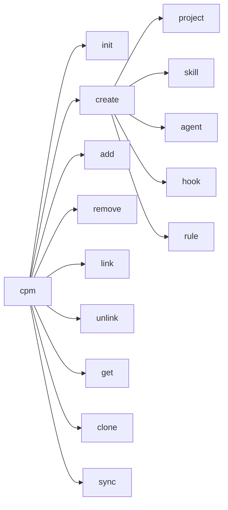

# CPM CLI Reference (TypeScript)

Complete reference for CPM command-line interface.

## Installation

```bash
npm install -g cpm
```

## Commands Overview



## Commands

### `cpm init`

Initialize a new CPM mono repo.

```bash
cpm init [directory] [options]
```

**Arguments:**
- `directory` - Directory to initialize (default: current directory)

**Options:**
- `-n, --name <name>` - Repository name

**Example:**
```bash
cpm init my-monorepo
cpm init . --name "My Project Hub"
```

---

### `cpm create`

Create new projects or shared components.

#### `cpm create project`

```bash
cpm create project <name> [options]
```

**Options:**
- `-d, --description <desc>` - Project description
- `-s, --skills <skills>` - Comma-separated skills to add
- `-a, --agents <agents>` - Comma-separated agents to add

**Example:**
```bash
cpm create project web-app -d "Web application"
cpm create project api --skills logging,auth
```

#### `cpm create skill`

```bash
cpm create skill <name> [options]
```

**Options:**
- `-d, --description <desc>` - Skill description
- `-s, --skills <skills>` - Dependent skills
- `-a, --agents <agents>` - Dependent agents
- `-h, --hooks <hooks>` - Dependent hooks
- `-r, --rules <rules>` - Dependent rules

**Example:**
```bash
cpm create skill code-review -d "Code review assistant"
cpm create skill advanced-review --skills code-review,security
```

#### `cpm create agent`

```bash
cpm create agent <name> [options]
```

**Options:** Same as `cpm create skill`

#### `cpm create hook`

```bash
cpm create hook <name> [options]
```

**Options:** Same as `cpm create skill`

#### `cpm create rule`

```bash
cpm create rule <name> [options]
```

**Options:** Same as `cpm create skill`

---

### `cpm add`

Add a shared component to a project.

```bash
cpm add <component> --to <project> [options]
```

**Arguments:**
- `component` - Component in format `type:name` (e.g., `skill:logging`)

**Options:**
- `-t, --to <project>` - Target project name (required)
- `--no-deps` - Don't install component dependencies

**Example:**
```bash
cpm add skill:logging --to web-app
cpm add agent:debugger --to api-server --no-deps
```

---

### `cpm remove`

Remove a shared component from a project.

```bash
cpm remove <component> --from <project> [options]
```

**Arguments:**
- `component` - Component in format `type:name`

**Options:**
- `-f, --from <project>` - Source project name (required)
- `--force` - Remove without confirmation

**Example:**
```bash
cpm remove skill:logging --from web-app
cpm remove agent:debugger --from api --force
```

---

### `cpm link`

Link dependencies to an existing shared component.

```bash
cpm link <dependencies> --to <target>
```

**Arguments:**
- `dependencies` - Comma-separated list (e.g., `skill:a,agent:b`)

**Options:**
- `-t, --to <target>` - Target component (required)

**Example:**
```bash
cpm link skill:base-utils --to skill:code-review
cpm link skill:logging,hook:validator --to agent:debugger
```

---

### `cpm unlink`

Remove dependencies from an existing shared component.

```bash
cpm unlink <dependencies> --from <target>
```

**Arguments:**
- `dependencies` - Comma-separated list

**Options:**
- `-f, --from <target>` - Source component (required)

**Example:**
```bash
cpm unlink skill:base-utils --from skill:code-review
```

---

### `cpm get`

Get project info with all resolved components.

```bash
cpm get <project> [options]
```

**Arguments:**
- `project` - Project name or path

**Options:**
- `-f, --format <format>` - Output format (`tree` | `json`, default: `tree`)
- `-r, --remote <url>` - Git repository URL (planned)
- `-d, --download` - Download project with all dependencies
- `-o, --output <dir>` - Output directory for download

**Example:**
```bash
cpm get web-app
cpm get web-app --format json
cpm get web-app --download
cpm get web-app --download --output ./temp
```

---

### `cpm clone`

Clone a project with all dependencies to a standalone directory.

```bash
cpm clone <project> <directory> [options]
```

**Arguments:**
- `project` - Project name
- `directory` - Target directory

**Options:**
- `--include-shared` - Also copy the full shared/ directory structure
- `--preserve-links` - Keep symlinks instead of copying

**Example:**
```bash
cpm clone web-app ./standalone
cpm clone web-app ./export --include-shared
cpm clone web-app ./linked --preserve-links
```

---

### `cpm sync`

Regenerate symlinks for shared components.

```bash
cpm sync [project] [options]
```

**Arguments:**
- `project` - Project name (optional with `--all`)

**Options:**
- `-a, --all` - Sync all projects

**Example:**
```bash
cpm sync web-app
cpm sync --all
```

---

## Global Options

```bash
cpm --help     # Show help
cpm --version  # Show version
```

## Exit Codes

| Code | Description |
|------|-------------|
| 0 | Success |
| 1 | Error |

---

<p align="center">
  <a href="https://transilience.ai"></a>
</p>

<p align="center">
  Crafted by <a href="https://transilience.ai">Transilience.ai</a>
</p>
