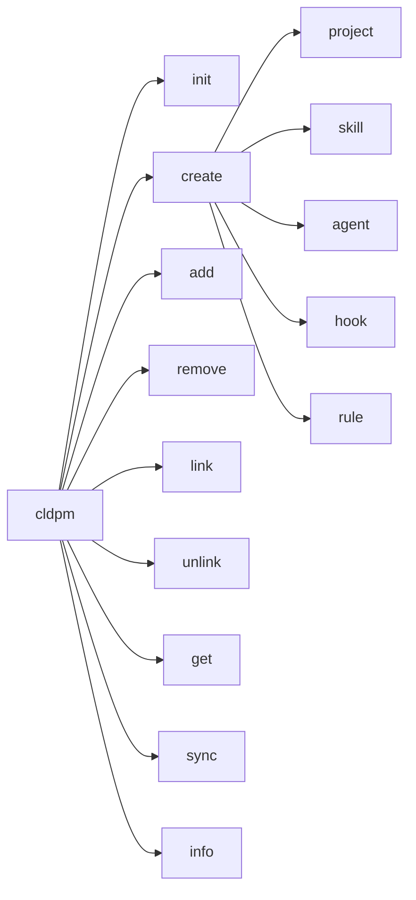

# CLDPM CLI Reference (TypeScript)

Complete reference for CLDPM command-line interface.

## Installation

```bash
npm install -g cldpm
```

## Commands Overview



## Commands

### `cldpm init`

Initialize a new CLDPM mono repo.

```bash
cldpm init [directory] [options]
```

**Arguments:**
- `directory` - Directory to initialize (default: current directory)

**Options:**
- `-n, --name <name>` - Repository name

**Created Files:**

| File | Purpose |
|------|---------|
| `cldpm.json` | Root mono repo configuration |
| `CLAUDE.md` | Instructions for Claude Code |
| `.cursor/rules/cldpm.mdc` | Rules for Cursor IDE |
| `.clinerules` | Rules for Cline |
| `.windsurfrules` | Rules for Windsurf |
| `.github/copilot-instructions.md` | Instructions for GitHub Copilot |
| `.gitignore` | Git ignore patterns |

**AI Tool Configuration:**

All AI tool files include CLDPM commands and project structure documentation. Content is wrapped with section markers (`<!-- CLDPM-SECTION-START -->` / `<!-- CLDPM-SECTION-END -->`) for easy updates.

**Example:**
```bash
cldpm init my-monorepo
cldpm init . --name "My Project Hub"
```

---

### `cldpm create`

Create new projects or shared components.

#### `cldpm create project`

```bash
cldpm create project <name> [options]
```

**Options:**
- `-d, --description <desc>` - Project description
- `-s, --skills <skills>` - Comma-separated skills to add
- `-a, --agents <agents>` - Comma-separated agents to add

**Example:**
```bash
cldpm create project web-app -d "Web application"
cldpm create project api --skills logging,auth
```

#### `cldpm create skill`

```bash
cldpm create skill <name> [options]
```

**Options:**
- `-d, --description <desc>` - Skill description
- `-s, --skills <skills>` - Dependent skills
- `-a, --agents <agents>` - Dependent agents
- `-h, --hooks <hooks>` - Dependent hooks
- `-r, --rules <rules>` - Dependent rules

**Example:**
```bash
cldpm create skill code-review -d "Code review assistant"
cldpm create skill advanced-review --skills code-review,security
```

#### `cldpm create agent`

```bash
cldpm create agent <name> [options]
```

**Options:** Same as `cldpm create skill`

#### `cldpm create hook`

```bash
cldpm create hook <name> [options]
```

**Options:** Same as `cldpm create skill`

#### `cldpm create rule`

```bash
cldpm create rule <name> [options]
```

**Options:** Same as `cldpm create skill`

---

### `cldpm add`

Add a shared component to a project.

```bash
cldpm add <component> --to <project> [options]
```

**Arguments:**
- `component` - Component in format `type:name` (e.g., `skill:logging`)

**Options:**
- `-t, --to <project>` - Target project name (required)
- `--no-deps` - Don't install component dependencies

**Example:**
```bash
cldpm add skill:logging --to web-app
cldpm add agent:debugger --to api-server --no-deps
```

---

### `cldpm remove`

Remove a shared component from a project.

```bash
cldpm remove <component> --from <project> [options]
```

**Arguments:**
- `component` - Component in format `type:name`

**Options:**
- `-f, --from <project>` - Source project name (required)
- `--force` - Remove without confirmation

**Example:**
```bash
cldpm remove skill:logging --from web-app
cldpm remove agent:debugger --from api --force
```

---

### `cldpm link`

Link dependencies to an existing shared component.

```bash
cldpm link <dependencies> --to <target>
```

**Arguments:**
- `dependencies` - Comma-separated list (e.g., `skill:a,agent:b`)

**Options:**
- `-t, --to <target>` - Target component (required)

**Example:**
```bash
cldpm link skill:base-utils --to skill:code-review
cldpm link skill:logging,hook:validator --to agent:debugger
```

---

### `cldpm unlink`

Remove dependencies from an existing shared component.

```bash
cldpm unlink <dependencies> --from <target>
```

**Arguments:**
- `dependencies` - Comma-separated list

**Options:**
- `-f, --from <target>` - Source component (required)

**Example:**
```bash
cldpm unlink skill:base-utils --from skill:code-review
```

---

### `cldpm get`

Get project info with all resolved components. Supports both local and remote repositories.

```bash
cldpm get <project> [options]
```

**Arguments:**
- `project` - Project name or path

**Options:**
- `-f, --format <format>` - Output format (`tree` | `json`, default: `tree`)
- `-r, --remote <url>` - Remote GitHub repo URL or shorthand (owner/repo)
- `-d, --download` - Download project with all dependencies to local directory
- `-o, --output <dir>` - Output directory for download (default: project name)

**Remote URL Formats:**
- `owner/repo` - GitHub shorthand
- `github.com/owner/repo` - Without https://
- `https://github.com/owner/repo` - Full URL
- `https://github.com/owner/repo/tree/branch` - With branch

**Environment Variables:**
- `GITHUB_TOKEN` or `GH_TOKEN` - For private repository access

**Example:**
```bash
# Local project info
cldpm get web-app
cldpm get web-app --format json

# Download local project with all dependencies
cldpm get web-app --download
cldpm get web-app -d -o ./standalone

# Remote repository (uses optimized sparse checkout)
cldpm get my-project -r owner/repo
cldpm get my-project -r owner/repo --download
cldpm get my-project -r https://github.com/owner/repo/tree/main -d -o ./local
```

**Note:** Remote downloads use Git sparse checkout to download only the required files, significantly reducing bandwidth for large repositories.

---

### `cldpm sync`

Regenerate symlinks for shared components.

```bash
cldpm sync [project] [options]
```

**Arguments:**
- `project` - Project name (optional with `--all`)

**Options:**
- `-a, --all` - Sync all projects

**Example:**
```bash
cldpm sync web-app
cldpm sync --all
```

---

### `cldpm info`

Display CLDPM information banner with ASCII art, quick start guide, and attribution.

```bash
cldpm info
```

**Output:**
Shows decorative banner with:
- CLDPM ASCII art logo
- Quick start commands
- Attribution (Crafted by Transilience.ai)
- Documentation and GitHub links

---

## Global Options

```bash
cldpm --help     # Show help
cldpm --version  # Show version and info banner
cldpm info       # Show info banner
```

## Exit Codes

| Code | Description |
|------|-------------|
| 0 | Success |
| 1 | Error |

---

<p align="center">
  <a href="https://transilience.ai"></a>
</p>

<p align="center">
  Crafted by <a href="https://transilience.ai">Transilience.ai</a>
</p>
