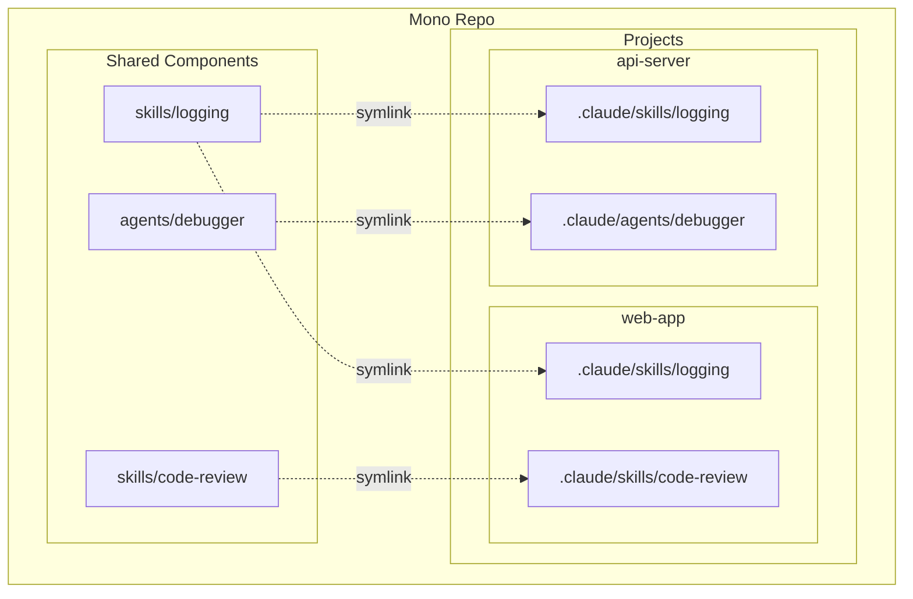

# CPM - Claude Project Manager (TypeScript SDK)

An SDK and CLI for managing mono repos with multiple Claude Code projects.

[](https://www.npmjs.com/package/cpm)
[](LICENSE)

## Overview

CPM enables sharing skills, agents, hooks, and rules across multiple Claude Code projects without duplication. It uses a hybrid linking strategy where references are stored in config files and symlinks are generated locally.



## Installation

```bash
npm install cpm
```

Or globally:

```bash
npm install -g cpm
```

## CLI Usage

```bash
# Initialize a new mono repo
cpm init my-monorepo
cd my-monorepo

# Create a project
cpm create project web-app

# Create shared components
cpm create skill logging
cpm create agent code-reviewer

# Add components to project
cpm add skill:logging --to web-app
cpm add agent:code-reviewer --to web-app

# View project with resolved dependencies
cpm get web-app

# Download project with all dependencies
cpm get web-app --download --output ./temp

# Clone a project to standalone directory
cpm clone web-app ./standalone

# After git clone, restore symlinks
cpm sync --all
```

## SDK Usage

```typescript
import {
  loadCpmConfig,
  resolveProject,
  listProjects,
  listSharedComponents,
  syncProjectLinks,
} from "cpm";

// Load configuration
const config = await loadCpmConfig("/path/to/monorepo");
console.log(`Repo: ${config.name}`);

// List all projects
const projects = await listProjects("/path/to/monorepo");
for (const project of projects) {
  console.log(`Project: ${project.name}`);
}

// Resolve a project with all dependencies
const project = await resolveProject("my-project", "/path/to/monorepo");
console.log(`Shared skills: ${project.shared.skills.map(s => s.name)}`);

// List all shared components
const components = await listSharedComponents("/path/to/monorepo");
console.log(`Skills: ${components.skills}`);

// Sync symlinks for a project
const result = await syncProjectLinks(projectPath, repoRoot);
console.log(`Created: ${result.created}`);
```

## Commands

| Command | Description |
|---------|-------------|
| `cpm init` | Initialize a new mono repo |
| `cpm create project` | Create a new project |
| `cpm create skill/agent/hook/rule` | Create shared components |
| `cpm add` | Add a shared component to a project |
| `cpm remove` | Remove a shared component from a project |
| `cpm link` | Link dependencies between shared components |
| `cpm unlink` | Remove dependencies between shared components |
| `cpm get` | Get project info with resolved dependencies |
| `cpm clone` | Clone a project with all dependencies |
| `cpm sync` | Regenerate symlinks for shared components |

## Documentation

| Document | Description |
|----------|-------------|
| [CLI Reference](CLI.md) | Complete CLI command reference |
| [SDK Reference](SDK.md) | Programmatic API documentation |
| [Contributing](CONTRIBUTING.md) | Contribution guidelines |
| [Security](SECURITY.md) | Security policy |
| [Code of Conduct](CODE_OF_CONDUCT.md) | Community guidelines |

## API Reference

### Schemas

```typescript
import {
  CpmConfig,
  ProjectConfig,
  ProjectDependencies,
  ComponentMetadata,
  ComponentDependencies,
  ComponentType,
  createCpmConfig,
  createProjectConfig,
  createComponentMetadata,
  parseComponentRef,
} from "cpm";
```

### Core Functions

```typescript
import {
  // Config
  loadCpmConfig,
  saveCpmConfig,
  loadProjectConfig,
  saveProjectConfig,
  getProjectPath,
  listProjects,
  loadComponentMetadata,
  saveComponentMetadata,

  // Resolver
  resolveProject,
  resolveComponent,
  resolveLocalComponent,
  listSharedComponents,
  resolveComponentDependencies,
  getAllDependenciesForComponent,

  // Linker
  syncProjectLinks,
  addComponentLink,
  removeComponentLink,
  createSymlink,
  removeProjectLinks,
  getLocalComponents,
  getSharedComponents,
} from "cpm";
```

## Development

```bash
# Install dependencies
npm install

# Build
npm run build

# Run tests
npm test

# Watch mode
npm run dev
```

## License

MIT License - see [LICENSE](LICENSE) for details.

---

<p align="center">
  <a href="https://transilience.ai"></a>
</p>

<p align="center">
  Crafted by <a href="https://transilience.ai">Transilience.ai</a>
</p>

<p align="center">
  Authored by <a href="https://github.com/amanagarwal041">Aman Agarwal</a>
</p>
