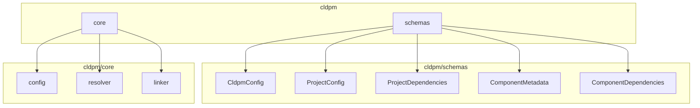

# CLDPM SDK Reference (TypeScript)

Programmatic API for CLDPM - Claude Project Manager.

## Installation

```bash
npm install cldpm
```

## Module Overview



## Schemas

### CldpmConfig

Root configuration schema for `cldpm.json`.

```typescript
import { CldpmConfigSchema, createCldpmConfig, type CldpmConfig } from "cldpm";

// Create config
const config = createCldpmConfig("my-repo", {
  version: "2.0.0",
  projectsDir: "apps",
  sharedDir: "components",
});

// Validate with Zod
const validated = CldpmConfigSchema.parse(data);
```

### ProjectConfig

Project configuration schema for `project.json`.

```typescript
import {
  createProjectConfig,
  createProjectDependencies,
  type ProjectConfig,
} from "cldpm";

const config = createProjectConfig("my-project", {
  description: "My project description",
  dependencies: createProjectDependencies({
    skills: ["logging", "code-review"],
    agents: ["debugger"],
  }),
});
```

### ComponentMetadata

Metadata schema for shared components.

```typescript
import {
  createComponentMetadata,
  createComponentDependencies,
  type ComponentMetadata,
} from "cldpm";

const metadata = createComponentMetadata("advanced-review", {
  description: "Advanced code review skill",
  dependencies: createComponentDependencies({
    skills: ["code-review", "security-check"],
  }),
});
```

---

## Core Functions

### Config Module

#### loadCldpmConfig

Load `cldpm.json` from a repository root.

```typescript
import { loadCldpmConfig } from "cldpm";

const config = await loadCldpmConfig("/path/to/monorepo");
console.log(config.name);         // "my-monorepo"
console.log(config.projectsDir);  // "projects"
console.log(config.sharedDir);    // "shared"
```

#### saveCldpmConfig

Save `cldpm.json` to a repository root.

```typescript
import { saveCldpmConfig, createCldpmConfig } from "cldpm";

const config = createCldpmConfig("new-repo");
await saveCldpmConfig(config, "/path/to/monorepo");
```

#### loadProjectConfig

Load `project.json` from a project directory.

```typescript
import { loadProjectConfig } from "cldpm";

const config = await loadProjectConfig("/path/to/project");
console.log(config.name);
console.log(config.dependencies.skills);
```

#### saveProjectConfig

Save `project.json` to a project directory.

```typescript
import { saveProjectConfig, createProjectConfig } from "cldpm";

const config = createProjectConfig("my-project", {
  description: "Test project",
});
await saveProjectConfig(config, "/path/to/project");
```

#### listProjects

List all projects in a repository.

```typescript
import { listProjects } from "cldpm";

const projects = await listProjects("/path/to/monorepo");
for (const project of projects) {
  console.log(`${project.name}: ${project.path}`);
}
```

#### getProjectPath

Get the path to a project by name.

```typescript
import { getProjectPath } from "cldpm";

const path = await getProjectPath("my-project", "/path/to/monorepo");
if (path) {
  console.log(`Found at: ${path}`);
}
```

#### loadComponentMetadata

Load metadata for a shared component.

```typescript
import { loadComponentMetadata } from "cldpm";

const metadata = await loadComponentMetadata(
  "skills",
  "code-review",
  "/path/to/monorepo"
);

if (metadata) {
  console.log(metadata.name);
  console.log(metadata.dependencies.skills);
}
```

---

### Resolver Module

#### resolveProject

Resolve a project with all its components.

```typescript
import { resolveProject } from "cldpm";

const project = await resolveProject("my-project", "/path/to/monorepo");

console.log(project.name);   // "my-project"
console.log(project.path);   // Full path
console.log(project.config); // ProjectConfig
console.log(project.shared); // { skills: [...], agents: [...], ... }
console.log(project.local);  // { skills: [...], agents: [...], ... }

// Access resolved skills
for (const skill of project.shared.skills) {
  console.log(`Skill: ${skill.name}`);
  console.log(`Source: ${skill.sourcePath}`);
  console.log(`Files: ${skill.files}`);
}
```

#### resolveComponent

Resolve a shared component.

```typescript
import { resolveComponent } from "cldpm";

const component = await resolveComponent(
  "skills",
  "code-review",
  "/path/to/shared"
);

if (component) {
  console.log(component.name);        // "code-review"
  console.log(component.type);        // "shared"
  console.log(component.sourcePath);  // Full path
  console.log(component.files);       // ["SKILL.md", "skill.json"]
}
```

#### listSharedComponents

List all shared components in a repository.

```typescript
import { listSharedComponents } from "cldpm";

const components = await listSharedComponents("/path/to/monorepo");

console.log(components.skills);  // ["logging", "code-review", ...]
console.log(components.agents);  // ["debugger", ...]
console.log(components.hooks);   // [...]
console.log(components.rules);   // [...]
```

#### resolveComponentDependencies

Resolve all dependencies for a component (including transitive).

```typescript
import { resolveComponentDependencies } from "cldpm";

const deps = await resolveComponentDependencies(
  "skills",
  "advanced-review",
  "/path/to/monorepo"
);

// Returns: [["skills", "code-review"], ["skills", "base-utils"], ...]
for (const [type, name] of deps) {
  console.log(`${type}/${name}`);
}
```

#### getAllDependenciesForComponent

Get all dependencies organized by type.

```typescript
import { getAllDependenciesForComponent } from "cldpm";

const deps = await getAllDependenciesForComponent(
  "agents",
  "debugger",
  "/path/to/monorepo"
);

console.log(deps.skills);  // ["logging", "analysis"]
console.log(deps.hooks);   // ["validator"]
```

---

### Linker Module

#### syncProjectLinks

Synchronize all symlinks for a project.

```typescript
import { syncProjectLinks } from "cldpm";

const result = await syncProjectLinks(projectPath, repoRoot);

console.log(result.created);  // ["skills/logging", "skills/code-review"]
console.log(result.missing);  // ["skills/nonexistent"]
```

#### addComponentLink

Add a single component symlink to a project.

```typescript
import { addComponentLink } from "cldpm";

const success = await addComponentLink(
  projectPath,
  "skills",
  "logging",
  repoRoot
);

if (success) {
  console.log("Symlink created");
}
```

#### removeComponentLink

Remove a component symlink from a project.

```typescript
import { removeComponentLink } from "cldpm";

const success = await removeComponentLink(projectPath, "skills", "logging");
```

#### removeProjectLinks

Remove all symlinks from a project.

```typescript
import { removeProjectLinks } from "cldpm";

await removeProjectLinks(projectPath);
```

#### getLocalComponents

Get all local (non-symlinked) components in a project.

```typescript
import { getLocalComponents } from "cldpm";

const local = await getLocalComponents(projectPath);

console.log(local.skills);  // ["my-local-skill"]
console.log(local.agents);  // []
```

#### getSharedComponents

Get all shared (symlinked) components in a project.

```typescript
import { getSharedComponents } from "cldpm";

const shared = await getSharedComponents(projectPath);

console.log(shared.skills);  // ["logging", "code-review"]
console.log(shared.agents);  // ["debugger"]
```

#### createSymlink

Create a symlink (low-level function).

```typescript
import { createSymlink } from "cldpm";

const success = await createSymlink(sourcePath, targetPath);
```

---

## Complete Example

```typescript
import {
  createCldpmConfig,
  saveCldpmConfig,
  createProjectConfig,
  createProjectDependencies,
  saveProjectConfig,
  resolveProject,
  listSharedComponents,
  syncProjectLinks,
} from "cldpm";
import { mkdir, writeFile } from "node:fs/promises";
import { join } from "node:path";

async function main() {
  const repoRoot = "/tmp/my-monorepo";

  // Create directory structure
  await mkdir(join(repoRoot, "projects"), { recursive: true });
  await mkdir(join(repoRoot, "shared", "skills"), { recursive: true });

  // Create and save CLDPM config
  const cldpmConfig = createCldpmConfig("my-monorepo");
  await saveCldpmConfig(cldpmConfig, repoRoot);

  // Create a shared skill
  const skillPath = join(repoRoot, "shared", "skills", "logging");
  await mkdir(skillPath, { recursive: true });
  await writeFile(join(skillPath, "SKILL.md"), "# Logging Skill");
  await writeFile(
    join(skillPath, "skill.json"),
    JSON.stringify({ name: "logging" })
  );

  // Create a project
  const projectPath = join(repoRoot, "projects", "web-app");
  await mkdir(join(projectPath, ".claude", "skills"), { recursive: true });

  const projectConfig = createProjectConfig("web-app", {
    dependencies: createProjectDependencies({ skills: ["logging"] }),
  });
  await saveProjectConfig(projectConfig, projectPath);

  // Sync symlinks
  const result = await syncProjectLinks(projectPath, repoRoot);
  console.log(`Created: ${result.created}`);

  // Resolve project
  const project = await resolveProject("web-app", repoRoot);
  console.log(`Project: ${project.name}`);
  console.log(`Shared skills: ${project.shared.skills.map((s) => s.name)}`);

  // List all components
  const components = await listSharedComponents(repoRoot);
  console.log(`Available skills: ${components.skills}`);
}

main();
```

---

## Types Reference

### ComponentType

```typescript
type ComponentType = "skills" | "agents" | "hooks" | "rules";
```

### ResolvedComponent

```typescript
interface ResolvedComponent {
  name: string;
  type: "shared" | "local";
  sourcePath: string;
  files: string[];
  metadata?: ComponentMetadata;
}
```

### ResolvedProject

```typescript
interface ResolvedProject {
  name: string;
  path: string;
  config: ProjectConfig;
  shared: Record<ComponentType, ResolvedComponent[]>;
  local: Record<ComponentType, ResolvedComponent[]>;
}
```

---

<p align="center">
  <a href="https://transilience.ai"></a>
</p>

<p align="center">
  Crafted by <a href="https://transilience.ai">Transilience.ai</a>
</p>
